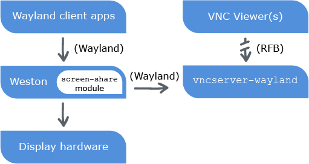
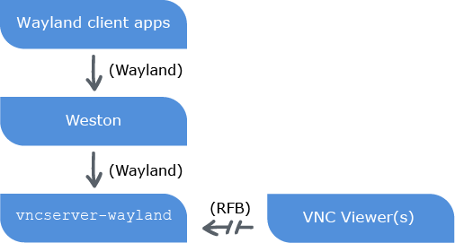

VNC and Wayland
===============

RealVNC are pleased to make available a free Developer Preview* of our flagship VNC product that enables VNC Server to run in a [Wayland](https://wayland.freedesktop.org/) environment, and remote desktops provided by the Weston reference compositor. Feedback [welcome](#feedback)!

\* *The Developer Preview is free for the Wayland development community to use, but please note it is provided “as is” and without warranty of any kind. Deployment is not recommended in a production environment.*

Getting started
===============

1. Download the relevant VNC for Wayland Developer Preview binary (32-bit or 64-bit), and the license key, from [GitHub Releases](https://github.com/RealVNC/wayland-developer-preview/releases). 

2. Checkout and build the [Wayland](https://cgit.freedesktop.org/wayland/wayland/) master branch. Note the Developer Preview was built against commit [113aac5](https://cgit.freedesktop.org/wayland/wayland/commit/?id=113aac5afbcce446e65d3d309a0e200b39c9e7ff).

3. Checkout the [Weston](https://cgit.freedesktop.org/wayland/weston/) master branch and build it with screen sharing, for example ``./autogen.sh --enable-screen-sharing``. The Developer Preview was built against commit [32abdbb](https://cgit.freedesktop.org/wayland/weston/commit/?h=1.7&id=32abdbbad97e99cc76409ecfa4b446db63907cc3). 

    **Note:** Reference instructions for setting up an evaluation environment are available [here](evaluation-environment-setup.md).

4. Download [VNC 5.2.0](https://www.realvnc.com/download/vnc/linux/5.2.0/) (note this is an older version), and install VNC Server by running a command such as ``sudo dpkg -i <VNC-Server>.deb`` or ``sudo rpm -U <VNC-Server>.rpm``.

5. Apply the license key to VNC Server by running the command ``sudo vnclicense -add <key>.vnclicense``.

   **Note:** The license key is valid until 30th June 2016. All [features](https://www.realvnc.com/products/vnc/#features) of VNC with an Enterprise license are included, except those listed [here](#restrictions).

6. Copy the three Developer Preview files to a path location such as ``/usr/local/bin``, and make sure they are executable.

7. Make sure your user is a member of the ``weston-launch`` and ``video`` groups.

8. Edit ``~/.config/weston.ini`` as follows:

   ```
   # ~/.config/weston.ini
   
   [core]
   modules=screen-share.so
   [screen-share]
   command=vncserver-wayland
   ```
   
Running VNC Server
==================

You can run VNC Server in two [modes](https://www.realvnc.com/products/vnc/documentation/5.3/modes/): User Mode and Virtual Mode. Note that certain [restrictions](#restrictions) apply.

To run VNC Server in User Mode
------------------------------

1. Launch a Weston desktop. 
 
2. Press Ctrl+Alt+S.

**Note:** is only useful to start VNC Server once per user session. 

VNC Server in User Mode interacts with Wayland and Weston as follows:



To run VNC Server in Virtual Mode
---------------------------------

Run the following command: 

``vncserver-virtual-wayland``

You can start VNC Server as many times as you like, to create as many virtual desktops as you need. 

VNC Server in Virtual Mode interacts with Wayland and Weston as follows:



Establishing a connection from VNC Viewer
-----------------------------------------

1. [Download](https://www.realvnc.com/download/viewer/latest/) VNC Viewer to any supported Windows, Mac, Linux, or UNIX computer.

2. Connect VNC Viewer to VNC Server using [these instructions](https://www.realvnc.com/products/vnc/documentation/5.3/getting-connected/). 

<a name="restrictions"></a>

Restrictions and notes
======================

This section lists differences between the Wayland and a standard X-based installation of VNC 5.2.0 with an Enterprise license:

* VNC Server in Service Mode (``vncserver-x11-serviced``) is not available.

* The VNC Server in Virtual Mode daemon (``vncserver-virtuald``) is not available.

* Printing, file transfer, chat, and copy and paste text are not available.

* Only the system credentials of the VNC Server owner (the user starting VNC Server) can be used to authenticate to VNC Server. To enable other VNC Viewer users to connect without sharing the owner’s system credentials, change the [authentication scheme](https://www.realvnc.com/products/vnc/documentation/5.2/guides/user/aj1103116.html) to VNC password.

* VNC Server can only remote a single output (screen). In User Mode, only the screen containing the mouse cursor at the point you started VNC Server is remoted. In Virtual Mode, a single screen is created, the resolution of which can be controlled by appending ``-geometry <W>x<H>`` to the ``vncserver-virtual-wayland`` start-up command.

* The cursor is currently captured as part of the screen image. Optimally, it should be captured separately to avoid triggering a screen update when the cursor moves.

* VNC Server dialogs draw their own window decorations, since by default the Weston compositor does not. If you are using a different desktop environment that can draw window decorations, disable those of VNC Server by specifying the ``WlClientDecorations`` VNC parameter in the file ``~/.vnc/config.d/vncserverui-wayland-<mode>``.

* Each connected VNC Viewer user gets their own mouse cursor, which can be operated independently of other connected users’ cursors, and that of the Linux computer.

<a name="feedback"></a>

Feedback and support
====================

Please [contact Support](mailto:waylandsupport@realvnc.com) to provide feedback, ask a question, or report a problem.


